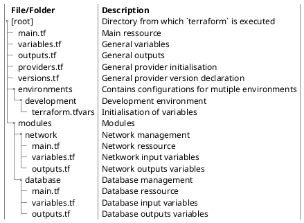

## Deployment overview

A simple basic deployment with
* one Loadbalancer
* one Instance hosting our Webapp
* multiple API instances
* managed Database
* dynamic IP addresses

We won't
- Ingress TLS nor between applications (e.g. mTLS)
* Fallback Loadbalacer
- Healthchecks

### Deployment diagram

Lets have multiple views on this. First from a general `Deployment diagram` point of view.

```plantuml
!include https://raw.githubusercontent.com/plantuml-stdlib/C4-PlantUML/master/C4_Deployment.puml
 
System_Boundary(mtintro, "Multi-Tier Web-Application [MTWA]",){
	Deployment_Node(lb, "Loadbalancer", "OVH Public VM, Envoy", "Loadbalancing all requests from outside. This includes API and Frontend requests from users.") 
	Deployment_Node(api, "Application Interface", "OVH Public Cloud VM", "Multiple stateless instances. Providing API to the fronend.")
	Deployment_Node(frontend, "Frontend application", "OVH Public Cloud VM", "Hosts ans provides frontend application to user.")
	Deployment_Node(manageddb, "DB Cluster", "OVH Managed DB Cluster"){
		ContainerDb(db, "Database", "Relational Database Schema", "Stores persistent appliation related information")
	}

	Rel(lb, api, "forewards api request", "http")
	Rel(lb, frontend, "forewards webapp request", "http")
	Rel(api, manageddb, "forewards api request", "http")
}
```

### Terraform project structure

Accordint to [Terraforms module-structure recommondation](https://developer.hashicorp.com/terraform/language/modules/develop#standard-module-structure) we are going to create something like this.



## Deployment implementation

For details on the structure and general configurations look into[[Terraform projects structure]] and  [[Terraform OVH Cloud VM]]. Following snippets will highly depend on the mentioned links.

No changes according to the initial setup needs to be done for
* `providers.tf`
* `versions.tf`

### Cleanup

* Delete all submodule directories in `modules/`

### Input, variable declarations and initialisation | `variables.tf`

```hcl
// Adds a new public key which we will initially add to all our VMS
resource "openstack_compute_keypair_v2" "vm_keypair" {
  name       = "vm_keypair"          # Name of the SSH key to use for creation
  public_key = file(var.ssh_keypair) # Path to your previously generated SSH key
}

# Resource reference: https://registry.terraform.io/providers/terraform-provider-openstack/openstack/latest/docs/resources/compute_instance_v2
# Create VM which we will later install our loadbalancer
resource "openstack_compute_instance_v2" "loadbalancer" {
  name        = "${var.environment}_loadbalancer"            # Instance name
  image_name  = "Ubuntu 22.10"                               # Image name
  flavor_name = "s1-2"                                       # Instance type name
  key_pair    = openstack_compute_keypair_v2.vm_keypair.name # Public key to deploy
  network {
    name = "Ext-Net" # Adds the network component to reach your instance
  }
}

# Resource reference: https://registry.terraform.io/providers/terraform-provider-openstack/openstack/latest/docs/resources/compute_instance_v2
# Create VM which we will later install our WebServer to host our frontend
resource "openstack_compute_instance_v2" "frontend" {
  name        = "${var.environment}_frontend"                # Instance name
  image_name  = "Ubuntu 22.10"                               # Image name
  flavor_name = "s1-2"                                       # Instance type name
  key_pair    = openstack_compute_keypair_v2.vm_keypair.name # Public key to deploy
  network {
    name = "Ext-Net" # Adds the network component to reach your instance
  }
}

# Resource reference: https://registry.terraform.io/providers/terraform-provider-openstack/openstack/latest/docs/resources/compute_instance_v2
# Creates 2 VMs which we will later install our API
resource "openstack_compute_instance_v2" "api" {
  count       = 2
  name        = "${var.environment}_api_${count.index}"      # Instance name
  image_name  = "Ubuntu 22.10"                               # Image name
  flavor_name = "s1-2"                                       # Instance type name
  key_pair    = openstack_compute_keypair_v2.vm_keypair.name # Public key to deploy
  network {
    name = "Ext-Net" # Adds the network component to reach your instance
  }
}
```

### Output | `outputs.tf`

```hcl
# Map of deployed public name and its ipv4 address
output "server_ips_and_names" {
  sensitive = true
}

# Database access information
output "database" {
  sensitive = true
}
```

### Initialisation | `environment/development/terraform.tfvars`

As you saw that we removed all `default`'s from `variables.tf` we need a new file which contains the current configuration.

```hcl
ssh_keypair = "./environment/development/keys/deployment_ssh.pub"
project_name = "MTWA"
environment = "development"
region = "DE1"
```

## Execute

```bash
terraform plan -var-file=environments/development/terraform.tfvars`
```